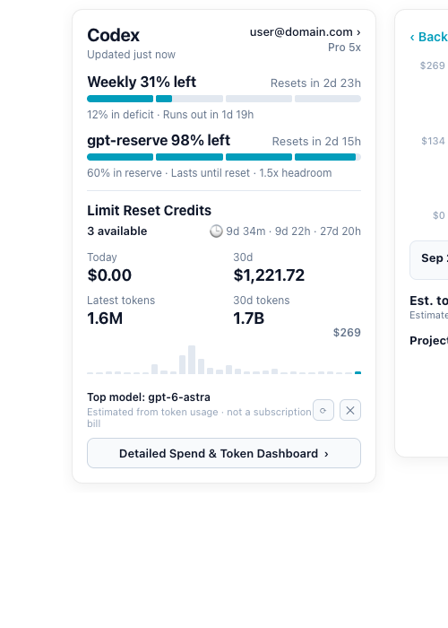

# TokenBar (CodexBar for macOS)

A native, lightweight macOS menu bar app for monitoring OpenAI Codex quota, rate limits, credit resets, and token/cost spend across all projects and models.

Compatible with **macOS 13+ (Ventura)**, **macOS 14 (Sonoma)**, and **macOS 15 (Sequoia)** on both **Intel (x86_64)** and **Apple Silicon (arm64)** Macs.

---

## Features

- 🎚️ **Live Menu Bar Status**: Displays your primary quota percentage and reset countdown right on your menu bar (e.g. `🎚️ 31%`).
- 💳 **Clean Quota Popover**:
  - **Weekly Quota & gpt-reserve Quota**: Segmented progress bars with deficit and headroom indicators.
  - **Limit Reset Credits**: Real-time remaining reset credits with individual countdown timers.
  - **Quick Stats (2x2)**: Today's spend, 30-day spend, latest session tokens, and 30-day total tokens.
  - **Mini Sparkline**: Interactive 30-day histogram overview.
  - **Active Model Highlight**: Displays your top model by token volume.
- 📊 **Detailed Spend & Token Dashboard**:
  - **Interactive 30-day Bar Chart**: SVG-rendered histogram with daily details.
  - **Token vs. Cost Toggle**: Easily switch between token counts and USD dollar values.
  - **Per-Model Daily Breakdown**: Click any day on the chart to see which models (`gpt-6-sol`, `gpt-5.6-sol`, `luna`, `astra`, `Codex Auto Review`, etc.) were used.
  - **Project Directory Breakdown**: Sorted by total consumption with one-click opening in Finder.
- ⚡ **Full Subagent & Reasoning Tracking**:
  - Accurately tracks tokens across subagents and different reasoning efforts (`max`, `high`, `medium`, `low`).
  - Pricing calculations updated to official rates from models.dev and Codex specifications.
- 🔄 **Ultra Fast & Low Overhead**:
  - Written in native Swift (`AppKit` + `WebKit`) and Python.
  - Incremental `mtime`-based session scanner takes less than 0.05s to scan hundreds of session rollouts.
  - Zero heavy third-party framework dependencies, eliminating macOS version incompatibilities.

---

## Screenshots

<p align="center">
  
</p>

---

## Quick Start / Build

### Prerequisites
- macOS 13.0 or later
- Command Line Tools / Xcode (`swiftc`, `python3`)

### Build and Install
Clone the repository and run the build script:

```bash
git clone https://github.com/yuhuan0669/tokenbar.git
cd tokenbar
chmod +x build.sh
./build.sh
```

The script compiles the Swift application, bundles the UI and scanner assets, and installs `CodexBar.app` directly into `~/Applications/CodexBar.app`.

### Launch
```bash
open ~/Applications/CodexBar.app
```

---

## Project Structure

```
tokenbar/
├── build.sh                 # Build and packaging script
├── scanner.py               # Usage & token scanner (Codex sessions + API)
├── src/
│   └── main.swift           # Native AppKit status item & popover controller
├── ui/
│   └── index.html           # WebKit frontend UI (Card + Dashboard views)
├── resources/
│   ├── AppIcon.icns         # High-resolution application icon
│   └── preview_card.png     # UI preview screenshot
└── .gitignore
```

---

## How It Works

1. **Authentication**: Uses your existing local authentication file at `~/.codex/auth.json` to query ChatGPT's `/wham/usage` and `/wham/rate-limit-reset-credits` endpoints.
2. **Session Parsing**: Recursively scans rollout JSONL files in `~/.codex/sessions/**/rollout-*.jsonl`, associating token usage records with their corresponding turn context (model name and reasoning effort).
3. **Repository Resolution**: Automatically identifies the root Git repository for each session folder to group statistics cleanly by project.
4. **Auto-refresh**: The background process checks for new session data every 60 seconds and immediately refreshes when you open the menu bar popover.

---

## License

MIT License. See [LICENSE](LICENSE) for details.
